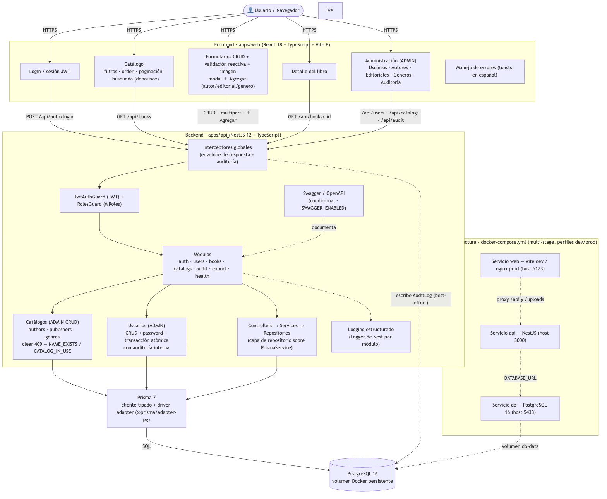
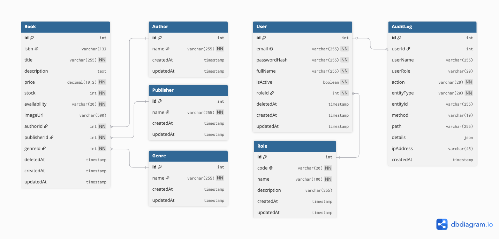
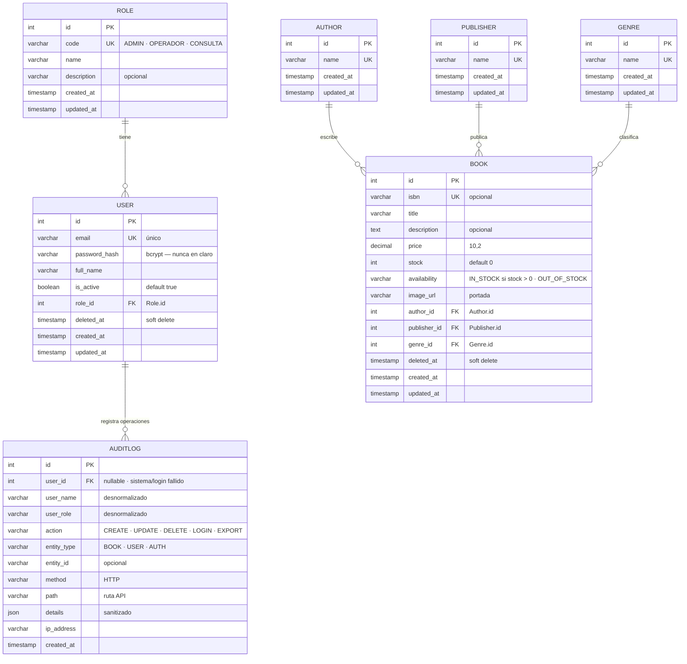

# CMPC Libros — Prueba Técnica Full Stack

Aplicación web completa para digitalizar el proceso de inventario de la tienda **CMPC Libros**:
gestión de catálogo, exploración avanzada, control de acceso por roles y auditoría de operaciones.

| Capa | Tecnología |
|---|---|
| Frontend | React 18 + TypeScript 6 + Vite 6 (apps/web) |
| Backend | NestJS 12 + TypeScript (apps/api) |
| Base de datos | PostgreSQL 16 + Prisma 7 (driver adapter) |
| Infraestructura | Docker Compose (postgres + api + web) |

> Documento de arquitectura y decisiones de diseño: [`docs/architecture.md`](docs/architecture.md)

---

## 1. Instalación y configuración

### Requisitos
- Docker Desktop / Docker Engine (compose) — el stack completo corre en contenedores
- Node.js **20+** (recomendado **22 LTS**, ver nota abajo) — solo si usarás los scripts npm del workspace en el host

> **Nota sobre el gestor de paquetes:** este proyecto usa **npm workspaces** (`package-lock.json`). Ejecuta siempre `npm install` desde la raíz — **no uses yarn ni pnpm**, su resolución de *engines* aborta con Node 20 (p. ej. `vitest@5` exige Node ≥22 como error duro en yarn, mientras npm solo emite un warning). Con Node v20.19.4 la instalación funciona; con Node **22+** además desaparecen los warnings `EBADENGINE` de Prisma/Vitest.

### Pasos (levantar desde cero con Docker Compose)

```bash
# 1. Clonar el repositorio
git clone <url-del-repositorio>
cd cmpc-books

# 2. Configurar entorno (opcional — hay valores por defecto seguros para dev)
cp .env.example .env        # en la raíz
# Editar JWT_SECRET con un valor real si lo deseas

# 3. Construir y levantar todo el stack (base de datos + API + web)
docker compose up --build
```

Ese único comando levanta y **deja listo desde cero** los tres servicios:

| Servicio | URL |
|---|---|
| Web (frontend React) | http://localhost:5173 |
| API (NestJS) | http://localhost:3000 |
| Swagger / OpenAPI | http://localhost:3000/api/docs |
| PostgreSQL | `localhost:5433` (usuario `cmpc` / password `cmpc` / db `cmpc_books`) |

Al arrancar, el contenedor de la API ejecuta automáticamente y de forma idempotente: `prisma generate` → `prisma migrate deploy` → `seed` (roles, usuario admin y catálogo demo) → servidor de desarrollo. No hay pasos manuales de base de datos.

Para detener: `docker compose down` (añade `-v` si quieres borrar también los datos del volumen `db-data` y empezar 100% desde cero).

---

### 🚀 Modo desarrollo local (hot-reload, sin Docker para API/Web)

Para iterar rápido con *hot reload* de la API (`node --watch`) y del frontend (Vite) directamente en el host:

#### Requisitos adicionales
- Node.js **20+** (recomendado **22 LTS**)
- npm (workspaces)
- PostgreSQL 16 disponible **o** Docker solo para la base de datos (lo más cómodo)

#### Pasos

```bash
# 1. Dependencias del monorepo (único npm install, desde la raíz)
npm install

# 2. Entorno (ajusta JWT_SECRET)
cp .env.example .env        # en la raíz

# 3. Base de datos — levanta PostgreSQL con Docker (crea la base automáticamente)
docker compose up -d db
#     → PostgreSQL publicado en localhost:5433
#       usuario: cmpc · password: cmpc · base: cmpc_books (todo creado al arrancar)
#     Comprueba que esté lista: docker compose ps db   (estado "healthy")

# 4. Preparar la base: cliente Prisma + migraciones + datos semilla
npm run migrate --workspace api
npm run seed --workspace api           # roles, admin y catálogo demo (idempotente)

# 5. Levantar servicios (dos terminales):
npm run dev:api             # API  → http://localhost:3000  (Node --watch)
npm run dev:web             # Web  → http://localhost:5173  (Vite, proxy /api y /uploads)
```

#### Qué hace cada comando

| Comando | Descripción |
|---|---|
| `npm run migrate --workspace api` | Genera el cliente Prisma y aplica las migraciones a la BD |
| `npm run seed --workspace api` | Carga roles, usuario admin y catálogo demo (seguro repetirlo) |
| `npm run dev:api` | Compila el API y lo ejecuta con **hot reload** en el cambio de código |
| `npm run dev:web` | Levanta Vite con *hot reload* y proxy automático de `/api` y `/uploads` al backend |

> 💡 Ver desplegable de servicios levantados:<br>
> Web: http://localhost:5173 · API: http://localhost:3000 · Swagger: http://localhost:3000/api/docs

### Usuarios por defecto (seed)
| Email | Contraseña | Rol |
|---|---|---|
| `admin@cmpc.libros` | `Admin123!` | Administrador |
| *(crear más desde el módulo Usuarios)* | | Operador / Consulta |

> ⚠️ En producción cambie `JWT_SECRET` y las credenciales del seed.

---

## 2. Guía de uso de la aplicación

### Inicio de sesión
- `http://localhost:5173` → formulario de acceso. Credenciales del seed arriba.
- El JWT se guarda en `localStorage`; al caducar se redirige automáticamente al login.

### Roles y permisos
| Módulo | Administrador | Operador | Consulta |
|---|:---:|:---:|:---:|
| Catálogo (listar / buscar / detalle) | ✅ | ✅ | ✅ |
| Exportar CSV | ✅ | ✅ | ❌ |
| Mantenedor de libros (crear/editar/eliminar) | ✅ | ❌ | ❌ |
| Gestión de usuarios | ✅ | ❌ | ❌ |
| Auditoría de operaciones | ✅ | ❌ | ❌ |

### Catálogo de libros (`/libros`)
- **Búsqueda**: en tiempo real con *debounce* (300 ms) por título, ISBN o autor.
- **Filtros**: género, editorial, autor y disponibilidad (Disponible / Agotado).
- **Ordenamiento**: clic en una columna ordena asc/desc (▲▼); **Mayús + clic** añade un segundo criterio (orden multi-campo).
- **Paginación**: lado del servidor; selector de 10/20/50 resultados.
- **Exportar CSV**: descarga `libros_YYYY-MM-DD.csv` con los mismos filtros aplicados (Administrador/Operador). El botón está disponible en la vista **Libros** (tanto en la barra superior como dentro del listado), ya que una exportación con otros módulos no tendría sentido.

### Mantenedor de libros (solo Administrador)
- **Nuevo / Editar**: validación reactiva por campo (título, ISBN, precio decimal > 0, stock entero ≥ 0, autor/editorial/género).
- **Portada**: subida de imagen JPEG/PNG/WebP (máx. 2 MB) con vista previa; se valida el contenido real del archivo (magic bytes), no solo la extensión.
- **Eliminar**: borrado lógico (*soft delete*) — el registro queda marcado y deja de aparecer, sin borrado físico.

### Usuarios (solo Administrador)
- Crear usuarios con rol y contraseña (mín. 8 caracteres, una mayúscula y un número).
- **Editar** nombre completo y rol de un usuario existente (el correo no se modifica).
- Activar/desactivar y eliminar (soft). Un administrador no puede desactivarse ni eliminarse a sí mismo.

### Auditoría (solo Administrador)
- Registro de operaciones: inicios de sesión (correctos y fallidos), creación/modificación/eliminación de libros y usuarios, exportaciones.
- Cada entrada guarda usuario ejecutor, rol, acción, entidad, método/ruta, IP y detalles.

### Documentación de la API
- **Swagger UI**: `http://localhost:3000/api/docs` (activado por defecto con `SWAGGER_ENABLED=true`).
- **JSON**: `http://localhost:3000/api/docs-json`.
- En **producción** (`SWAGGER_ENABLED=false`) el módulo **no se registra** y la ruta devuelve 404.

---

## 3. Arquitectura y decisiones de diseño

Resumen ejecutivo — detalles ampliados en [`docs/architecture.md`](docs/architecture.md).

### Diagrama de arquitectura del sistema



*Fuente editable (Mermaid): [`docs/diagrams/architecture.mmd`](docs/diagrams/architecture.mmd)*

### Estructura del monorepo
```
cmpc-books/
├── apps/
│   ├── api/                       # NestJS 12
│   │   ├── prisma/                # schema.prisma + migraciones + seed
│   │   └── src/
│   │       ├── common/            # guards, decoradores, interceptores, filtro de errores, PrismaService
│   │       └── modules/           # auth, users, books, catalogs, audit, health
│   └── web/                       # React 18 + Vite
│       └── src/                   # features/ (auth, books, users, audit) + lib/ + layout/ + shared/
├── docker-compose.yml
└── docs/
```

### Decisiones clave (resumen)
| # | Decisión |
|---|---|
| ADR-01 | **Monorepo npm workspaces** — un `npm install`, versiones consistentes, entrega en un solo repo. |
| ADR-02 | **Arquitectura modular por capas** (controller → service → repository vía PrismaService) — SOLID, testeable con mocks. |
| ADR-03 | **Prisma 7** con `schema.prisma` declarativo, migraciones y cliente tipado (requisito). Conexión vía **driver adapter** (`@prisma/adapter-pg`), patrón oficial de Prisma 7. |
| ADR-04 | **Modelo normalizado**: `Role`, `User`, `Author`, `Publisher`, `Genre`, `Book`, `AuditLog` con sus relaciones e índices para las consultas frecuentes. |
| ADR-05 | **JWT** (firma HMAC, expiración `JWT_EXPIRES_IN`) + guards **`JwtAuthGuard` global** y **`RolesGuard`** con decorador `@Roles(...)`. Todo endpoint requiere autenticación por defecto; `@Public()` solo en login y health. |
| ADR-06 | **Soft delete** (`deletedAt`) en libros y usuarios; consultas filtran por defecto. |
| ADR-07 | **Disponibilidad derivada del backend**: `IN_STOCK` si `stock > 0`, nunca aceptada del cliente. |
| ADR-08 | **Auditoría por interceptor global**: captura actor del JWT, acción, entidad y detalles; escritura *fail-tolerant* (nunca rompe la operación de negocio). |
| ADR-09 | **Envelope de respuesta** uniforme `{ok,data}` / `{ok,error}` vía interceptor + filtro global. |
| ADR-10 | **CSV con BOM UTF-8** para Excel (ñ, tildes, precios con 2 decimales). |
| ADR-11 | **Swagger condicional** (`SWAGGER_ENABLED`, por defecto `true`) — en producción el módulo no se registra. |
| ADR-12 | **Imágenes en disco local** con volumen Docker (interfaz aislada — migrable a S3/CDN). Validación de contenido real (magic bytes). |
| ADR-13 | **Logging estructurado** con el Logger nativo de Nest por contexto de módulo (sin dependencias extra, suficiente para el alcance). |

### Seguridad implementada
- Contraseñas con **bcrypt** (10 rondas); jamás se devuelven hashes.
- Login no revela si falló el email o la contraseña (mensaje único).
- Lista blanca de campos de ordenamiento (evita inyección en `orderBy`).
- Nombres de archivos generados por servidor (UUID + extensión por MIME); el nombre del cliente nunca se usa.
- Inyección de dependencias y validación estricta en todos los DTOs.

---

## 4. Modelo relacional de la base de datos

### Diagrama (generado con dbdiagram.io)



*Fuente editable (DBML): [`docs/diagrams/schema.dbml`](docs/diagrams/schema.dbml) — versión interactiva en https://dbdiagram.io/d*

### Vista alternativa (Mermaid — GitHub la renderiza nativamente)

> El diagrama siguiente es un bloque Mermaid: **GitHub lo renderiza nativamente** como imagen dentro de este documento.



### Fuentes de los diagramas (para generar/editar las imágenes)
| Diagrama | Imagen versionada | Archivo fuente | Cómo regenerar |
|---|---|---|---|
| Modelo relacional (ERD) | [`docs/diagrams/database-model.png`](docs/diagrams/database-model.png) | [`docs/diagrams/schema.dbml`](docs/diagrams/schema.dbml) | https://dbdiagram.io/d → pegar el código → **Export → PNG/SVG** |
| Modelo relacional (alternativa) | *(embebido en los .md)* | [`docs/diagrams/er-model.mmd`](docs/diagrams/er-model.mmd) | https://mermaid.live → pegar → **Export → PNG/SVG** (GitHub renderiza el bloque nativo) |
| Arquitectura del sistema | [`docs/diagrams/architecture.png`](docs/diagrams/architecture.png) | [`docs/diagrams/architecture.mmd`](docs/diagrams/architecture.mmd) | https://mermaid.live → pegar → **Export → PNG/SVG** |

---

## 5. API — resumen de endpoints

Documentación completa e interactiva en Swagger (`/api/docs`). Principales:

| Método | Ruta | Acceso |
|---|---|---|
| POST | `/api/auth/login` | público |
| GET | `/api/auth/me` | autenticado |
| GET | `/api/books` | autenticado (paginación, búsqueda, filtros, orden) |
| GET | `/api/books/:id` | autenticado |
| GET | `/api/books/export` | ADMIN / OPERADOR (CSV) |
| POST/PATCH/DELETE | `/api/books...`, `/api/books/:id/image` | ADMIN |
| GET | `/api/authors` · `/api/publishers` · `/api/genres` | autenticado |
| GET/POST/PATCH/DELETE | `/api/users...` | ADMIN |
| GET | `/api/audit` · `/api/audit/stats` | ADMIN |
| GET | `/api/health` | público |

---

## 6. Testing

```bash
npm run test --workspace api      # API: 86 tests unitarios (Vitest + Nest real)
npm run test:cov --workspace api  # API: ~82% statements / 88% líneas (excluye cliente Prisma generado)
npm run test --workspace web      # Web: 133 tests (Vitest)
npm run test:cov --workspace web  # Web: ~86% líneas
```

- Backend: `supertest` no instalado, los tests usan `Test.createTestingModule` real de `@nestjs/testing` con `PrismaService` mockeado y **bcrypt real** (round-trip de hash).
- Frontend: Testing Library sobre páginas reales con strings en español; `lib/` al 99–100%.

---

## 7. Docker Compose y despliegue

### Servicios
| Servicio | Puerto host | Descripción |
|---|---|---|
| `db` | 5433 → 5432 | PostgreSQL 16 (volumen persistente `db-data`) |
| `api` | 3000 | NestJS en modo dev (`npm run start:dev`) con bind-mount |
| `web` | 5173 | Vite dev con proxy `/api` y `/uploads` → api |

### Perfil de producción
Los `Dockerfile` son **multi-stage** con target `prod`:
- **api**: build `tsc` + `prisma migrate deploy` + `node dist/main.js`
- **web**: build estático + **nginx** (SPA fallback + proxy `/api` y `/uploads`)

```bash
# Prod (API en modo producción, Swagger desactivado):
SWAGGER_ENABLED=false docker compose --profile prod up --build -d
```

### Variables de entorno (`.env`)
| Variable | Defecto | Descripción |
|---|---|---|
| `DATABASE_URL` | interno | Conexión Prisma (en compose apunta al servicio `db`) |
| `JWT_SECRET` | `changeme` | Firma JWT — **cambiar en prod** |
| `JWT_EXPIRES_IN` | `12h` | Expiración del token |
| `SWAGGER_ENABLED` | `true` | Documentación API (desactivar en prod) |
| `API_PORT` | `3000` | Puerto del API |
| `POSTGRES_*` | `cmpc` | Credenciales de la base |

---

## 8. Supuestos documentados

1. Sin registro público de usuarios: los usuarios los crea el Administrador (el requerimiento solo pide login).
2. Todo el catálogo requiere sesión (nada público salvo login y health).
3. Token JWT único de acceso (sin *refresh rotation*), 12 h por defecto.
4. Imágenes en disco local con volumen Docker; la interfaz de guardado está aislada para migrar a S3/CDN.
5. `availability` se deriva de `stock` (no hay campo booleano independiente).
6. La auditoría es *best-effort*: si falla el registro, no bloquea la operación de negocio.
7. El CSV exporta las filas que coinciden con los filtros actuales, máx. 1000 por seguridad.
8. `price` se devuelve como string Decimal de Prisma; el frontend lo formatea para mostrar.

---

## 9. Alcance de la entrega vs. requerimientos del PDF

| Requerimiento | Estado |
|---|---|
| Login de autenticación (JWT) | ✅ |
| Listado: filtros avanzados (género/editorial/autor/disponibilidad) | ✅ |
| Ordenamiento dinámico multi-campo | ✅ |
| Paginación del lado del servidor | ✅ |
| Búsqueda en tiempo real con debounce | ✅ |
| Formulario alta/edición con validación reactiva | ✅ |
| Carga de imagen por libro | ✅ |
| Visualización de datos del libro (detalle) | ✅ |
| Backend modular SOLID | ✅ |
| Endpoints RESTful CRUD libros | ✅ |
| Exportación CSV | ✅ |
| Soft delete | ✅ |
| Logging / auditoría de operaciones (interceptor global + tabla) | ✅ |
| PostgreSQL + Prisma (migraciones, schema.prisma, cliente tipado, índices, transacciones documentadas) | ✅ |
| Tests unitarios frontend y backend ≥ 80% de cobertura (núcleo) | ✅ |
| docker-compose.yml completo | ✅ |
| README, Swagger, diagramas, modelo relacional | ✅ |
| Manejo de errores frontend y backend | ✅ |
| Interceptores de NestJS para transformación de respuestas | ✅ |
| Roles de usuario (ADMIN / OPERADOR / CONSULTA) + restricción por rol | ✅ (extensión solicitada) |
| Swagger activable por variable de entorno | ✅ (extensión solicitada) |