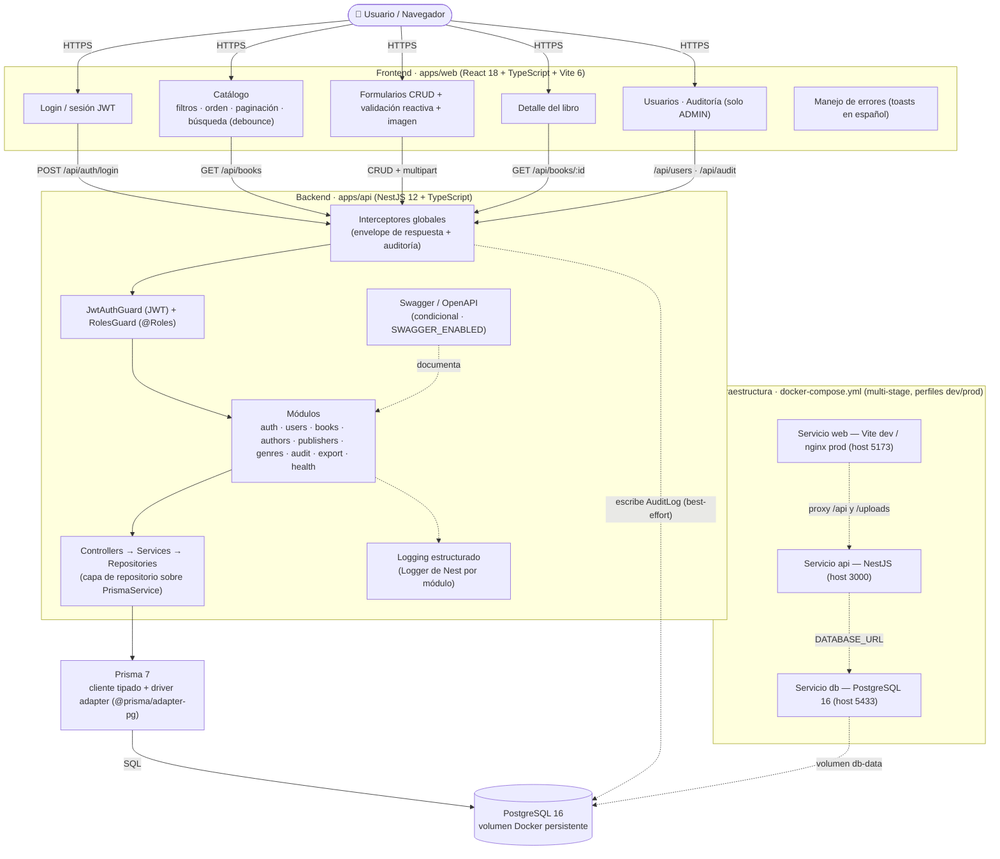
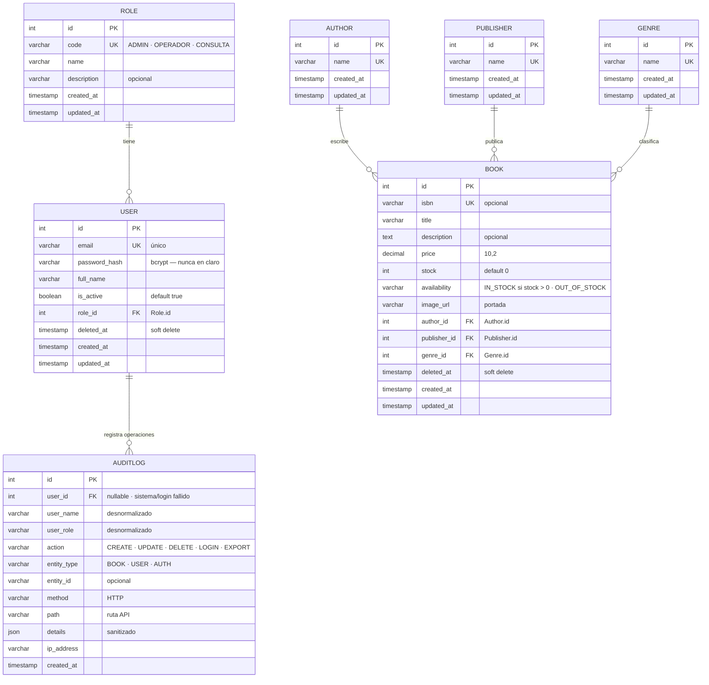

# CMPC Libros — Documento de Arquitectura y Diseño

> Prueba Técnica Full Stack · CMPC Libros
> Stack: React + TypeScript (Frontend) · NestJS + TypeScript (Backend) · PostgreSQL (Base de datos)

---

## 1. Visión General

Aplicación web full stack que digitaliza el proceso de inventario de la tienda CMPC Libros.
El sistema ofrece acceso autenticado, exploración avanzada del catálogo, módulos mantenedores
CRUD, exportación CSV, auditoría de operaciones y control de acceso basado en roles.

### Datos del dominio Libro
| Campo | Tipo |
|---|---|
| `title` | string |
| `author` | relación de entidad |
| `publisher` (editorial) | relación de entidad |
| `price` | decimal |
| `availability` | derivado de `stock` (`IN_STOCK` cuando `stock > 0`) |
| `genre` | relación de entidad |

---

## 2. Decisiones de Arquitectura (resumen ADR)

| # | Decisión | Fundamentación |
|---|---|---|
| ADR-01 | **Monorepo con npm workspaces** (`apps/api`, `apps/web`) | Entrega en un único repositorio (requisito), tooling compartido, un solo `npm install`, versiones consistentes |
| ADR-02 | **Backend modular por capas** (controller → service → repository) | Cumplimiento SOLID; las interfaces sobre los repositorios permiten el mocking en tests unitarios |
| ADR-03 | **ORM Prisma** con `schema.prisma` declarativo, migraciones y cliente tipado | Requisito explícito; mejor DX + consultas tipadas |
| ADR-04 | **Únicamente token de acceso JWT** (sin refresh token) | Suficiente para el alcance de la prueba; reduce complejidad/superficie de ataque; documentado como supuesto |
| ADR-05 | **Control de acceso basado en roles** (RBAC) mediante `RolesGuard` + decorador `@Roles()` | Módulos mantenedores solo para administrador; acceso de solo lectura para el resto de roles |
| ADR-06 | **Soft delete** en libros (`deletedAt`) | Requisito explícito; las consultas filtran `deletedAt IS NULL` por defecto |
| ADR-07 | **Log de auditoría en tabla dedicada** (`AuditLog`) + logging estructurado | Registra el usuario actor (desde JWT) por operación; sobrevive al borrado de usuarios gracias a campos desnormalizados |
| ADR-08 | **Almacenamiento de imágenes: disco local vía volumen Docker** | Viable en producción para una sola instancia; supuesto documentado (el cambio a S3/Cloudinary queda aislado en un servicio de almacenamiento) |
| ADR-09 | **Swagger condicional** mediante variable de entorno `SWAGGER_ENABLED` (por defecto `true`) | La documentación de la API no debe existir en producción; el módulo no se registra al desactivarse |
| ADR-10 | **Modelo de datos normalizado** con índices sobre las consultas frecuentes | Requisito: "modelo de datos normalizado" + "índices para consultas frecuentes" |
| ADR-11 | **Interceptores globales de NestJS** para dar forma a las respuestas y capturar auditoría | Requisito adicional explícito |
| ADR-12 | **Paginación del lado del servidor, ordenamiento multi-campo, búsqueda con debounce** | Requisitos explícitos de frontend y backend |

---

## 3. Arquitectura del Sistema

> Diagrama Mermaid embebido — GitHub lo renderiza nativamente como imagen. Fuente editable: `docs/diagrams/architecture.mmd`.



**Infraestructura** — `docker-compose.yml` orquesta tres servicios:
- `db` — PostgreSQL con volumen con nombre
- `api` — NestJS (build multi-stage, perfiles dev y prod)
- `web` — Aplicación React (en dev hace proxy al API; en prod se sirve estáticamente)

---

## 4. Modelo de Datos (Relacional)

> Diagrama Mermaid embebido — GitHub lo renderiza nativamente como imagen. Fuente editable: `docs/diagrams/er-model.mmd` (DBML para dbdiagram.io: `docs/diagrams/schema.dbml`).



### Relaciones
- `User N:1 Role`
- `Book N:1 Author`, `Book N:1 Publisher`, `Book N:1 Genre`
- `AuditLog N:1 User` (nullable — eventos de sistema/intentos de login)

### Índices (consultas frecuentes)
| Tabla | Índice | Propósito |
|---|---|---|
| `Book` | `(authorId)` | filtrar por autor |
| `Book` | `(publisherId)` | filtrar por editorial |
| `Book` | `(genreId)` | filtrar por género |
| `Book` | `(availability)` | filtrar por disponibilidad |
| `Book` | `(title)` | búsqueda full-text / ILIKE |
| `AuditLog` | `(userId, createdAt)` | historial de auditoría por usuario |
| `AuditLog` | `(entityType, entityId)` | historial de auditoría por entidad |

---

## 5. Roles y Matriz de Acceso

| Capacidad | ADMIN | OPERADOR | CONSULTA |
|---|:---:|:---:|:---:|
| Ver catálogo (listado/detalle/búsqueda) | ✅ | ✅ | ✅ |
| Exportar CSV | ✅ | ✅ | ❌ |
| Mantenedor de libros (crear/actualizar/eliminar) | ✅ | ❌ | ❌ |
| Gestión de usuarios (crear/desactivar usuarios, roles) | ✅ | ❌ | ❌ |
| Ver log de auditoría | ✅ | ❌ | ❌ |

**Supuestos**
1. Sin registro público de usuarios — los usuarios los provisiona el ADMIN (el requisito solo pide login).
2. Todo endpoint requiere una sesión válida (nada es público).
3. El claim `role` del JWT decide la autorización a nivel de endpoint.

---

## 6. Diseño del Backend (NestJS)

### Estructura de módulos
```
apps/api/src/
├── main.ts                 (Swagger condicional, prefijo global, validation pipe)
├── app.module.ts           (ConfigModule.global, composición de módulos)
├── config/                 (validación de entorno vía Joi o class-validator)
├── common/
│   ├── interceptors/       (ResponseInterceptor, AuditInterceptor)
│   ├── guards/             (JwtAuthGuard, RolesGuard)
│   ├── decorators/         (@Roles, @CurrentUser)
│   ├── filters/            (HttpExceptionFilter — forma unificada de error)
│   └── repositories/       (patrón BaseRepository, PrismaService)
└── modules/
    ├── health/             (GET /api/health — liveness)
    ├── auth/               (POST /api/auth/login → JWT)
    ├── users/              (CRUD de usuarios solo administrador)
    ├── books/              (CRUD + soft delete + consulta de listado)
    ├── authors/            (mantenedor ligero)
    ├── publishers/         (mantenedor ligero)
    ├── genres/             (mantenedor ligero)
    ├── audit/              (consulta de auditoría solo administrador)
    └── export/             (GET /api/books/export.csv)
```

### Mecanismos clave
- **Autenticación**: `POST /api/auth/login` valida credenciales (bcrypt) y devuelve un JWT firmado `{ sub, role, ... }` (caducidad por defecto 12 h — supuesto documentado).
- **RBAC**: `JwtAuthGuard` adjunta el usuario; `RolesGuard` lee la metadata de `@Roles()` y la compara con el claim del JWT.
- **Soft delete**: marca de tiempo `deletedAt`; el filtro por defecto en la capa de servicio lo excluye.
- **Transacciones**: `$transaction` de Prisma para operaciones críticas de múltiples escrituras (p. ej. la cadena de creación de un libro, consistencia entre auditoría y mutación).
- **Auditoría**: un interceptor global captura `{ user, action, entityType, entityId, method, path, details, ip }` y persiste en `AuditLog` de forma asíncrona (fire-and-forget con fallo tolerante — la auditoría nunca debe romper la operación de negocio).
- **Manejo de errores**: el filtro global de excepciones devuelve `{ ok: false, error: { code, message, details? } }`; el frontend muestra mensajes humanizados.
- **Exportación**: `GET /api/books/export?filters...` emite CSV con BOM UTF-8 (compatibilidad Excel) y respeta los filtros activos.

### Forma de la respuesta de la API (vía interceptor)
```json
{ "ok": true, "data": {...} }
{ "ok": false, "error": { "code": "VALIDATION_FAILED", "message": "...", "details": [...] } }
```

---

## 7. Diseño del Frontend (React + TypeScript)

```
apps/web/src/
├── app/providers (api-client, sesión de autenticación)
├── features/
│   ├── auth/        (pantalla de login, almacenamiento de sesión, redirect-on-401)
│   ├── books/       (listado + tabla con filtros/orden/paginación/búsqueda con debounce)
│   ├── book-form/   (crear/editar con validación reactiva + carga de imagen)
│   ├── book-detail/ (vista de detalle de solo lectura)
│   ├── users/       (solo administrador)
│   └── audit/       (solo administrador)
├── shared/          (componentes de UI, visualización de errores, formateadores)
└── router (navegación consciente del rol: el admin ve los módulos mantenedores)
```

### Mecanismos clave
- **Flujo de autenticación**: login → almacenar JWT (cookie httpOnly vía API o localStorage según despliegue; por defecto cookie httpOnly con CORS — supuesto documentado) → refresco de sesión en 401 mediante redirección.
- **Listado del catálogo**: paginación del lado del servidor (`page`, `pageSize`), ordenamiento multi-columna (`sortBy[]`, `order[]`), filtros avanzados (género/editorial/autor/disponibilidad), búsqueda con debounce (300 ms) contra `GET /api/books`.
- **Validación reactiva**: validación por campo + a nivel de formulario con feedback inmediato (p. ej. `react-hook-form` + esquemas `zod` compartidos con el contrato del backend).
- **Carga de imagen**: formulario multipart al crear/actualizar un libro; vista previa antes de enviar.
- **Manejo de errores**: cliente de API centralizado que normaliza las respuestas `{ ok:false }` en toasts/errores de campo visibles al usuario.

---

## 8. Configuración y Entorno

| Variable | Por defecto | Descripción |
|---|---|---|
| `DATABASE_URL` | `postgresql://cmpc:cmpc@db:5432/cmpc_books` | Conexión Prisma (Docker) |
| `JWT_SECRET` | *(obligatoria en prod)* | Secreto de firma |
| `JWT_EXPIRES_IN` | `12h` | TTL del token de acceso |
| `SWAGGER_ENABLED` | `true` | `false` en producción → el módulo Swagger no se registra |
| `PORT` | `3000` | Puerto del API |
| `NODE_ENV` | `development` | Perfil de ejecución |

`.env.example` está versionado; los secretos reales viven en `.env` (gitignored) / secretos de docker.

---

## 9. Hitos (plan de trabajo)

| # | Hito | Entregable | Mapeo del PDF |
|---|---|---|---|
| M0 | Fundaciones | git, monorepo, docker-compose, health, Swagger condicional | DevOps §1, Docs §1 |
| M1 | Capa de datos | esquema Prisma (normalizado), migración, seed (roles, admin, datos demo) | BD §1–2 |
| M2 | Autenticación y usuarios | login JWT, guards RBAC, módulo de usuarios admin, bcrypt | Front §1, Back §2 |
| M3 | CRUD de libros | endpoints REST, soft delete, validación, carga de imagen, transacciones | Front §3, Back §3,5 |
| M4 | Catálogo y exportación | filtros, orden multi-campo, paginación server, búsqueda con debounce, CSV | Front §2, Back §4 |
| M5 | Auditoría y logging | interceptor global de auditoría, AuditLog, logging estructurado, consulta admin | Back §6, Adic. §2 |
| M6 | Frontend completo | UI de login, listado, formulario, detalle, manejo de errores, navegación por rol | Front 1–4, Adic. §1 |
| M7 | Calidad y entrega | tests ≥80%, README, documentación Swagger, diagramas, pulido final | Testing, Docs, Entrega |

---

## 10. Estrategia de Testing

- **Backend (Vitest + Nest real)**: tests unitarios de services y controllers con repositorios mockeados; migraciones ejecutadas sobre la base real.
- **Frontend (Vitest)**: tests de componentes para listado, formulario y login; tests de servicios para el cliente de API y la lógica de debounce.
- **Objetivo de cobertura ≥ 80 %** en ambos apps.
- Los repositorios se mockean en el límite de la interfaz (SOLID + unidades rápidas).

---

## 11. Entregables de Documentación

- `README.md` — instalación, uso, resumen de arquitectura, decisiones de diseño (enlaza este documento).
- Swagger/OpenAPI — autogenerado en `/api/docs` (cuando está activo).
- Diagrama de arquitectura — fuente editable en [`docs/diagrams/architecture.mmd`](diagrams/architecture.mmd) (Mermaid; render en mermaid.live o GitHub).
- Modelo relacional — dos fuentes editables: [`docs/diagrams/schema.dbml`](diagrams/schema.dbml) (DBML oficial de dbdiagram.io, validado con `dbml2sql`) y [`docs/diagrams/er-model.mmd`](diagrams/er-model.mmd) (Mermaid `erDiagram`, render nativo en GitHub).

### Generación de imágenes
| Fuente | Herramienta | Pasos |
|---|---|---|
| `schema.dbml` | https://dbdiagram.io/d | Pegar el contenido del archivo → **Export → PNG / SVG / PDF** |
| `architecture.mmd` / `er-model.mmd` | https://mermaid.live | Pegar el contenido → **Export → PNG / SVG** |

---

## 12. Supuestos Documentados (requisito explícito del ejercicio)

1. Sin rotación de refresh token; un único token de acceso JWT con TTL de 12 h.
2. Sin registro público; el ADMIN provisiona los usuarios.
3. Todos los endpoints requieren autenticación.
4. Las imágenes se guardan en disco local vía volumen Docker (interfaz lista para S3, documentada).
5. `availability` se deriva de `stock` (sin booleano separado).
6. Las escrituras de auditoría son best-effort (nunca bloquean la transacción de negocio).
7. La exportación CSV usa los filtros actualmente aplicados; BOM UTF-8 para compatibilidad con Excel.
8. La app web en dev hace proxy de `/api` al backend; el perfil de producción sirve los estáticos compilados mediante un servidor estático simple o un proxy frontal.